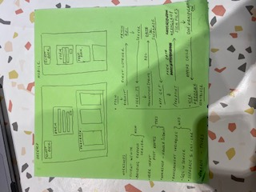

Client link:https://week4assignment-1.onrender.com

Server link:https://week4assignment.onrender.com

GitHub repo link:https://github.com/zkrylbntz/week4assignment

Screenshots of your Trello board, wireframes, any project planning docs.

Reflection

Please also provide an assignment reflection in your project README.md file.

Required

🎯 What requirements did you achieve?

🎯 Were there any requirements or goals that you were unable to achieve?

🎯 If so, what was it that you found difficult about these tasks?

Optional

🏹 Feel free to add any other reflections you would like to share about your submission, for example:

Requesting feedback about a specific part of your submission.

What useful external sources helped you complete the assignment (e.g YouTube tutorials)?

What errors or bugs did you encounter while completing your assignment? How did you solve them?

What went really well and what could have gone better?

This week I feel like I had met all but two requirements, those being the two in regards to the form submitting to the database, and the post api route.
On Friday I had made good ground, the planning side of things led me to feel confident in starting the assignment. And by the end of the day on Friday I had set everything up and my information was able to be seeded into the database and then brought back and appearing in my container on the webpage.

However I ran into an issue that is way above me when it came to submitting my form. I checked my endpoints, my post endpoint was working but whenever I submitted from my form the console log would say that the 404 was not found. That was on my inspect page console.
But the problem was it was saying that it was an app.get and not a app.post which this specific endpoint was assigned too. I tried re-writing it out, I debugged with several classmates and after looking at my computer for about 3 hours in the same position I stepped back and left it how it was.

I came to style it today as I was far as I physically could get, and I was getting quite frustrated. As you can see the information itself isn't displayed very well, and after researching several ways of displaying the data from the database I could not make it look at all how I wanted it too. And so with that, the plans of my desktop and mobile media queries were not as obtainable as I first thought.
Currently media queries are stressing me out. My styling never feels like it warrants any changes need, when I make it smaller in the inspect view, it scales down with it. And when I do try and change something it doesn't go the way I want it too. I've added one in this assignment, technically my mobile view, and the constant one is my desktop view (I'm not sure if we were meant to do it that way, or have two seperate ones as well as the constant view if that makes sense?)

I had good experiences when debugging with my fellow classmates on Friday and on Saturday evening, although technically I didn't get what I needed sorting, I enjoy trying to help also.

As far as requesting any feedback, it would be nice to get your opinion on my styling. I know so far it's been pretty plain, in comparison to work I've seen of other classmates, I think I am a bit plainer than others... if that makes sense. I feel confident about how I want it too look and that it's to my taste as such, but executing it feels harder than it should be and I'm wondering if it's a little thing that I'm unable to see that I'm tripping up on or making harder for myself.

Thanks

I have written this before my final push and changing my URLs around in my code for my deployment.
I also don't know much about markdown so this is my first time putting in images, so I hope I've done it correct, I will add them in with my submission on Moodle, just incase
